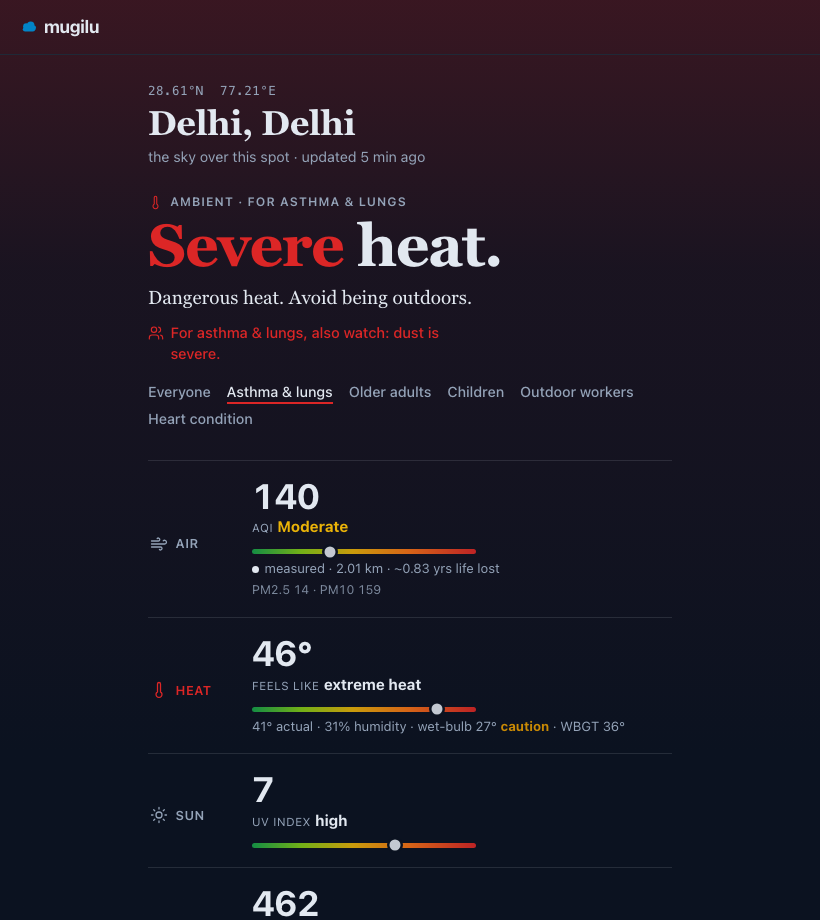

# mugilu

[](https://github.com/urbanmorph/mugilu/actions/workflows/ci.yml) [](./LICENSE) [](https://mugilu.live) [](https://mugilu.live/mcp) [](https://workers.cloudflare.com)

**The open sky of India, one coordinate at a time.** Give a point anywhere in India and get what the sky is doing to you right now: air, heat (with wet-bulb), rain, UV, dust, and the official government warning over that spot. Open, free, and built to be read by people, apps, and AI agents alike.

> ಮುಗಿಲು is Kannada for *cloud / sky*. The third tool in a small commons, alongside **[bharatlas](https://bharatlas.com)** (open geo) and **[mdshare](https://mdshare.live)**. Live at **[mugilu.live](https://mugilu.live)**.



## Try it

- **[mugilu.live](https://mugilu.live)** — type any place, in any language (ಬೆಂಗಳೂರು · दिल्ली · சென்னை)
- a point: **[/c/12.97,77.59](https://mugilu.live/c/12.97,77.59)** · a place: **[/c/bengaluru](https://mugilu.live/c/bengaluru)** · for someone: **[/c/delhi?as=asthma](https://mugilu.live/c/delhi?as=asthma)**

## What it is

Everywhere else the sky is split up and locked away: air apps show air, weather apps show weather, the government's own data sits in separate apps that do not talk to each other, and the tools that do combine anything are paywalled and modelled. mugilu stitches it back into one location-addressable layer for India.

- **`coordinate → conditions`** for any point: air quality from real ground stations, heat and wet-bulb, rain, UV, dust, and active **NDMA / SACHET** warnings.
- An **Ambient** read that names the single worst hazard for you and what to do about it, weighted by who is asking: asthma, older adults, children, outdoor workers, heart condition.
- Every reading as **HTML** for people, **JSON** for apps, **Markdown** for LLMs, and an **MCP** server for agents.

## Use it

Open and keyless. The same reading, four ways:

```bash
# JSON — by coordinate or by name, optionally weighted for a vulnerability
curl https://mugilu.live/c/12.97,77.59.json
curl "https://mugilu.live/c/delhi.json?as=asthma"
```

A trimmed response (full layers: `air`, `heat`, `rain`, `uv`, `dust`, `wind`, `visibility`, `smoke`, `warnings`):

```json
{
  "schema": "mugilu/conditions",
  "version": 1,
  "place": "Delhi, Delhi",
  "ambient": {
    "risk_band": "severe",
    "driver": "heat",
    "persona": "asthma",
    "summary": "Dangerous heat. Avoid being outdoors."
  },
  "air":  { "kind": "measured", "aqi": 140, "band": "moderate", "yll_years": 0.83 },
  "heat": { "apparent_c": 46, "wet_bulb_c": 27 },
  "attribution": "… via mugilu",
  "disclaimer": "Informational only — not for medical, emergency, or safety-critical decisions."
}
```

**For AI agents** — an MCP server (JSON-RPC 2.0 over Streamable HTTP):

```bash
npx @modelcontextprotocol/inspector --cli https://mugilu.live/mcp --transport http --method tools/list
```

…or add `https://mugilu.live/mcp` as a custom connector in Claude or Cursor and ask *"is it safe for my asthmatic kid to play outside in Indiranagar right now?"*

| Route | Returns |
|---|---|
| `/c/{lat},{lon}` (+ `.json` `.md` `.png`) | conditions at a point — HTML, JSON, Markdown, or share image |
| `/c/{slug}` | a named place, e.g. `/c/bengaluru` |
| `?as=` (asthma · elderly · child · outdoor · heart) | weight the Ambient read for a vulnerability |
| `/near` · `/suggest` | nearest air stations · place search (native scripts work) |
| `/index.json` · `/warnings.json` | national air leaderboard · active NDMA/IMD warnings |
| `/embed/{lat},{lon}` | embeddable card, one line of HTML |
| `/mcp` · `/openapi.json` · `/llms.txt` | MCP server · OpenAPI 3.1 spec · LLM manifest |
| `?ref=your-app` | self-identify on any API/embed call (aggregate attribution) |

## Run it locally

One Cloudflare Worker, forkable and self-hostable. Needs **Node 22+**, **[pnpm](https://pnpm.io)**, and — to deploy — a Cloudflare account.

```bash
git clone https://github.com/urbanmorph/mugilu.git
cd mugilu && pnpm install
cd apps/worker

pnpm dev        # local dev → http://localhost:8787
pnpm test       # the test suite (node --test via tsx)
pnpm typecheck  # tsc --noEmit
pnpm deploy     # wrangler deploy (your CF account + the KV/R2/D1 bindings in wrangler.toml)
```

The air snapshot, national grid, and warnings are refreshed by crons into R2, so a fresh fork is empty until the first cron runs (or you hit the `/collect` routes).

## Architecture

A single Cloudflare Worker. Crons refresh the air snapshot hourly, poll and archive NDMA/SACHET warnings hourly, and sample a national heat/rain/UV/dust grid every four hours, all to R2. A request to `/c/{lat},{lon}` assembles the nearest-station air, live Open-Meteo weather, and point warnings into one normalized schema, so each source is a swappable adapter. Near-zero client JS; no database on the read path.

## Principles

- **Free, open, MIT.** For individuals. **Non-commercial**, always.
- **Whole-sky, never air alone.** Heat, rain, UV, dust, and official warnings are first-class.
- **No warranty, no accuracy guarantee.** Informational and educational only, **not for medical, emergency, or safety-critical decisions.** For official hazard warnings, consult NDMA and IMD directly.
- **Honest about the moat.** It is the stitch, the openness, and the interface, not the data. The data belongs to others and is credited. Measured and modelled are labelled; thin-coverage layers are marked or left out.
- **Minimal and fast.** Cloudflare free tier, near-zero JS, no database.

How mugilu follows the People's Digital Goods & Infrastructure principles is tracked in **[PDGI.md](./PDGI.md)**; the glass-box methodology (every threshold) is at **[/methodology](https://mugilu.live/methodology)**.

## Data and attribution

Air is mirrored from **[oaq.notf.in](https://oaq.notf.in)** (the Open Air Quality broker: **CPCB**, **Airnet** by [CSTEP](https://cstep.in), and **Aurassure**) and OpenAQ. Weather, heat, UV, and dust come from **[Open-Meteo](https://open-meteo.com)** (CC-BY 4.0). Warnings come from **NDMA / SACHET** and **IMD**. Geography comes from **[bharatlas](https://bharatlas.com)**. Health-impact figures use the **[AQLI](https://aqli.epic.uchicago.edu/)** methodology (U Chicago EPIC). **Each source keeps its own licence** — see the per-page attribution and `/terms`.

## Contributing

Issues and PRs welcome. A new data source is a new adapter into the normalized schema; tests are required (`pnpm test`) and changes go on a branch (deploys are manual via `pnpm deploy`). The repo is small on purpose — read [`apps/worker/src/index.ts`](./apps/worker/src/index.ts) to see the whole route surface in one place.

## License

Code: **MIT** (see [LICENSE](./LICENSE)). Data is **not** relicensed: each upstream source's licence and attribution apply.

---

made by [urbanmorph](https://urbanmorph.com) · a digital commons · [pdgi.org](https://pdgi.org)
